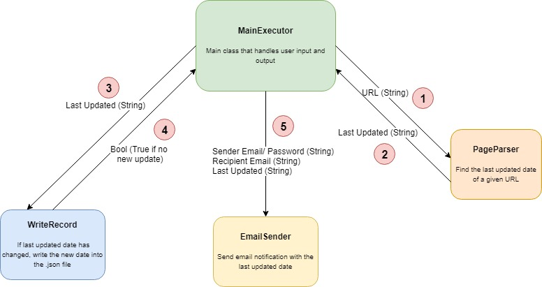

# ContentChangeNotifier Description
__Idea__: Check any wikipedia page for when it was last updated, and send an email notifying the user of the change

I got this idea from when my friends and I were talking about how many changes were made to Donald Trump's Wikipedia page, sometimes more than 20 times a single day. So I thought it would be cool to be able to find, without having to go to the page itself, the date and time that the wikipedia article was changed. Over time, I modified the project to include numerous other types of features such as sending email notifications when a page has been changed, and hope to continue expanding on this project in order to increase its usefulness.

# Program Organization
At this point, the project contains the following:
* __MainExecutor.java__ - contains the main method that directs the execution of all conponents of the project. All user input for this project will be entered here, for which a GUI has been crafted to streamline the process. 
* __PageParser.java__ - takes a URL and finds when it was last updated (limitation - works only for Wikipedia articles)
* __WriteRecord.java__ - saves the last updated date in a .json file, and determines whether an email needs to be sent (only when there is a difference between the saved message and the new message that both point to the same URL)
* __EmailSender.java__ - sends the email to the user. Keep in mind that both the sender and the recipient must have their restrictions turned off on this account or else exceptions will be thrown (usually allowing a 'third party entity' to access the account)



# Resources
* __javax.mail.jar__ and __activation.jar__ - resources needed to send the email 
* __json-simple-1.1.1.jar__ - resource used to implement .json file reading and writing


# How to build and run
There are a couple things to remember when modifying or using this code:
* The main programs are MainExecutor.java, PageParser.java, EmailSender.java, and WriteRecord.java
* You will also need all the .jar files to run 
* There also needs to be an existing .json file named record.json (can be empty object [{}] or non-empty) - the WriteRecord.java static methods will use this file as a base to either modify or create new entries to be referenced in the future
* To compile the program (in linux): ```javac -cp \* MainExecutor.java PageParser.java EmailSender.java WriteRecord.java```
* To run the program (in linux): ```java -cp .:\* MainExecutor```
* For more information, please see https://stackoverflow.com/questions/9395207/how-to-include-jar-files-with-java-file-and-compile-in-command-prompt

# What I learned
* __VIM Editor and Unix System__ - This was the first time that I wrote code on an editor on a Linux system. Previously for school, we would write code on Eclipse (IDE), which was more user friendly towards people just starting to code. I had to research a lot on how to use VIM (all its shortcuts and commands), how to download and get everything working in the shell, and then how to manually import and compile all the components I needed to test / debug my code. By the end of this project, I learned some Linux commands as well as basics about Unix.
* __Design__ - Originally, this project started out as one .java file. But it became obvious that as more features were added on, the more complex the organization of the project was going to be. In school, the layout of the project was already given to us; we just needed to fill in the missing code to make it work. So it was a steep yet rewarding learning curve to have to organize my code.
* __JSON__ - Prior to Freshman year, I had no idea how to store information from programs externally in other files. Part of this project requries some way to store information from previous executions of the program, so I had to find a way to do so. I liked JSON for its structured yet very flexible setup, and can definetely see myself using this type of data file again in the near future.
* __Scraping / Parsing__ - Scraping a URL and parsing the aquired information were two things that I had never learned in a classroom. I had to look for a lot of resources and tools, as well as look at the HTML code behind Wikipedia pages, to accurately pull and read out the information I wanted. 
* __Sending Email via Java code__ - This was probably one of the most challenging part of this entire project. A good majority of the code in EamilSender.java was copied from someone else, and even then it took me a long time to be able to make it work the way I wanted. Part of it was because I had to understand from scratch what the code I copied was actually doing. But most of it was because through trial and error. I discovered that for most email servers (gmail, yahoo) the recipient had to allow third party entities to send them mail (something that Gmail itself does not recommend doing). Otherwise, my program would be able to send the email yet get denied by the recipient's email server, thereby throwing an error. In short, I got a lot of practice debugging and researching how email sending really works
* __Using outside resources__ - Over time, I realized most of the tasks I wanted to do were already possible with certain java libraries and functions, so I ended up spending a majority of the time learning and testing how to make use of them. To streamline this process, I borrowed sample code from sites such as StackOverflow, W3School, and GeeksforGeeks. Even though there was a lot of copying, I still felt like I learned quite a bit just by looking at the work of others and editing the code to fit what was needed. Sometimes the code that I borrowed just did not work, and part of the learning process was to find out why it did not work, and what changes could be made to get it up and running. 

# Side Note
* Over the couse of this summer (of 2019) I wrote another project in Python called SysPerfAnalysis (https://github.com/jazhang1999/SysPerfAnalysis) that incorporated some of the lessons I learned from this project. In the future, I would like to modify this project to bring it in line with what I am learning over time. While I have enough working code in this repository to call it a functionable project, there is much more that I want to do and improve to sharpen my java programming skills.
